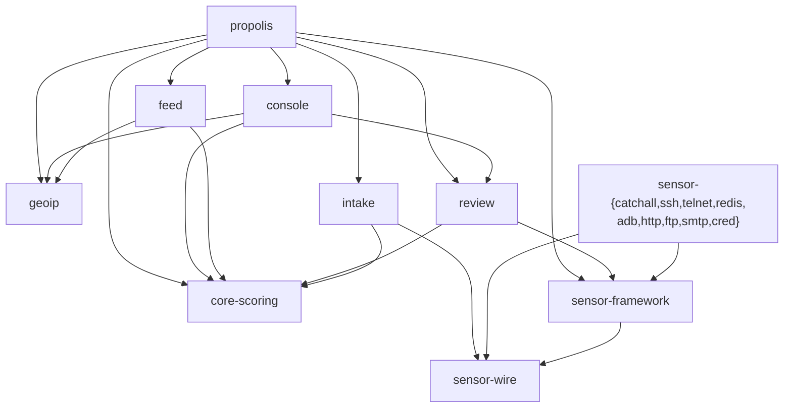

<!--
title: Component inventory
audience: developer
status: current
owner: maintainer
applies-to: 0.3.0 (untagged; latest tag v0.1.0)
last-verified: 2026-08-26
-->

# Components

The workspace (`Cargo.toml`, `resolver = "2"`, `edition = "2024"`) has **18 member
crates** under `crates/`, all at version `0.3.0`, producing **15 binaries**. This page
is the canonical owner of the component inventory and the inter-crate dependency graph.

## Crate inventory

| Crate | Kind | Binary | Purpose |
|---|---|---|---|
| `sensor-wire` | library (leaf) | none | Frozen sensor->intake NDJSON wire format (`WIRE_VERSION = 1`); the single source of truth imported by every sensor and by intake. |
| `core-scoring` | library (leaf) | none | Event ledger and scoring engine: append events, chain-hashing, `ip_score`, blocklist eligibility; owns the core migrations. |
| `geoip` | library (leaf) | none | Offline MaxMind GeoLite2 City + ASN enrichment (local file reads only, egress-free); both DBs optional. |
| `sensor-framework` | library | none | Shared sensor harness: TCP/UDP listener lifecycle, WAN attribution, sanitize, event emit, quarantine spool, capture hand-off, fake shell/fs, persona, bounds. |
| `sensor-catchall` | lib + bin | `sensor-catchall` | Passive protocol-agnostic TCP/UDP catch-all; emits `catchall_probe` for unprompted traffic. |
| `sensor-ssh` | lib + bin | `sensor-ssh` | SSH honeypot: full handshake via own crypto primitives, fake shell, SCP/SFTP capture. |
| `sensor-telnet` | lib + bin | `sensor-telnet` | Telnet honeypot: minimal option negotiation, accepts any credential, shared fake shell. |
| `sensor-redis` | lib + bin | `sensor-redis` | Redis honeypot: parses RESP (inline + multi-bulk), canned replies, captures creds and suspicious commands. |
| `sensor-adb` | lib + bin | `sensor-adb` | ADB honeypot: `CNXN` handshake and fake device banner, serves `shell:` via the fake shell, captures `sync:` pushes to spool. |
| `sensor-http` | lib + bin | `sensor-http` | HTTP honeypot sensor (per-connection handler over the shared listener). |
| `sensor-ftp` | lib + bin | `sensor-ftp` | FTP honeypot: capture hand-off and quarantine spool for uploads. |
| `sensor-smtp` | lib + bin | `sensor-smtp` | SMTP honeypot sensor (per-connection handler over the shared listener). |
| `sensor-cred` | lib + bin | `sensor-cred` | Credential-capture sensor covering the DB/remote protocols VNC, MySQL, MSSQL, PostgreSQL, MongoDB. |
| `intake` | lib + bin | `intake` | Converts sensor wire events into core-scoring domain events; tails sensor NDJSON logs and appends to the ledger. |
| `review` | lib + bin | `review` | Review-queue state machine, gatekeeper, vendor adapters (AbuseIPDB/DShield/OTX), VirusTotal scanner, malware fetcher, submission runner, and operator CLI. Owns its own migrator. |
| `feed` | lib + bin | `feed` | Blocklist feed pipeline: read `ip_score` into a `FeedSnapshot`, export text/JSON/CSV/CIDR, atomic publish with a checksummed manifest. |
| `console` | lib + bin | `console` | Operator web console (axum): auth (argon2 password / session / CSRF / rate-limit), dashboard, review queue, IP detail, feed status, `/metrics`, live `/logs`. |
| `propolis` | binary only | `propolis` | Unified daemon composing intake + review + feed + console + VirusTotal + fetcher + ops-monitor as concurrent tokio tasks on one `PgPool`. |

Source: `Cargo.toml:1-22`; each crate's `Cargo.toml` and `src/lib.rs` / `src/main.rs`.

### Library vs. binary

- **Pure libraries (no binary):** `sensor-wire`, `core-scoring`, `geoip`,
  `sensor-framework`.
- **Sensor lib+bin crates (9):** `sensor-catchall`, `sensor-ssh`, `sensor-telnet`,
  `sensor-redis`, `sensor-adb`, `sensor-http`, `sensor-ftp`, `sensor-smtp`,
  `sensor-cred`. These 9 sensor crates cover 12 protocols (the `cred` sensor serves
  five: VNC/MySQL/MSSQL/PostgreSQL/MongoDB).
- **Data-plane lib+bin crates (4):** `intake`, `review`, `feed`, `console` each carry
  both `src/lib.rs` and `src/main.rs`, so each produces a library and a same-named
  binary. Only `review` declares an explicit `[[bin]]`; the others use cargo's default
  binary-from-`main.rs`.
- **Binary only:** `propolis` (no `src/lib.rs`).

**15 binaries total:** the 9 sensor binaries plus `intake`, `review`, `feed`,
`console`, and `propolis`.

Sensors have **no compiled-in default port** - listen addresses come from
config/environment set by the deploy units, not from source. See
[../reference/ports-and-protocols.md](../reference/ports-and-protocols.md).

## Dependency graph

Internal dependencies are declared as `path=` entries. Leaves (no internal deps):
`sensor-wire`, `core-scoring`, `geoip`.

Source: the `[dependencies]` sections of each crate's `Cargo.toml` (e.g.
`intake/Cargo.toml:7-8`, `review/Cargo.toml:9,17`, `console/Cargo.toml:9,12,20`,
`propolis/Cargo.toml:8-14`).

`propolis` links the four data-plane service libraries directly and re-runs their
loops in-process; each subsystem-loop carries a `Mirrors <crate>/src/main.rs` doc
comment. It depends on **no** `sensor-*` binary crate - sensors are separate OS
processes, covered in [process-topology.md](process-topology.md).
