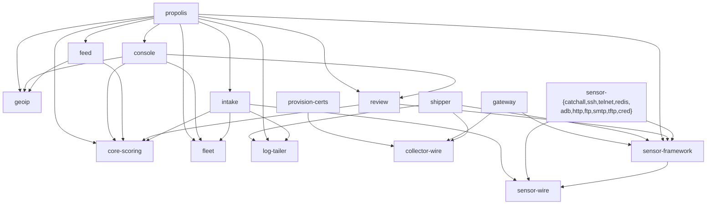

<!--
title: Component inventory
audience: developer
status: current
owner: maintainer
applies-to: 0.4.0 (untagged; latest tag v0.1.0)
last-verified: 2026-08-26
-->

# Components

The workspace (`Cargo.toml`, `resolver = "2"`, every crate `edition = "2024"`) has
**25 member crates** under `crates/`, producing **18 binaries**. Nineteen crates are at
version `0.4.0`; the six added since `0.3.0` (`collector-wire`, `fleet`, `gateway`,
`log-tailer`, `provision-certs`, `shipper`) are at `0.1.0`. This page is the canonical
owner of the component inventory and the inter-crate dependency graph.

## Crate inventory

| Crate | Kind | Binary | Purpose |
|---|---|---|---|
| `sensor-wire` | library (leaf) | none | Frozen sensor->intake NDJSON wire format (`WIRE_VERSION = 1`); the single source of truth imported by every sensor and by intake. |
| `core-scoring` | library (leaf) | none | Event ledger and scoring engine: append events, chain-hashing, `ip_score`, blocklist eligibility; owns the core migrations. |
| `geoip` | library (leaf) | none | Offline MaxMind GeoLite2 City + ASN enrichment (local file reads only, egress-free); both DBs optional. |
| `sensor-framework` | library | none | Shared sensor harness: TCP/UDP listener lifecycle, WAN attribution, sanitize, event emit, quarantine spool, capture hand-off, fake shell/fs, persona, bounds. |
| `sensor-catchall` | lib + bin | `sensor-catchall` | Passive protocol-agnostic TCP/UDP catch-all; emits `catchall_probe` for unprompted traffic. |
| `sensor-ssh` | lib + bin | `sensor-ssh` | SSH honeypot: full handshake via own crypto primitives, fake shell, SCP/SFTP capture. |
| `sensor-telnet` | lib + bin | `sensor-telnet` | Telnet honeypot: minimal option negotiation, accepts any credential, shared fake shell. |
| `sensor-redis` | lib + bin | `sensor-redis` | Redis honeypot: parses RESP (inline + multi-bulk), canned replies, captures creds and suspicious commands. |
| `sensor-adb` | lib + bin | `sensor-adb` | ADB honeypot: `CNXN` handshake and fake device banner, serves `shell:` via the fake shell, captures `sync:` pushes to spool. |
| `sensor-http` | lib + bin | `sensor-http` | HTTP honeypot sensor (per-connection handler over the shared listener). |
| `sensor-ftp` | lib + bin | `sensor-ftp` | FTP honeypot: capture hand-off and quarantine spool for uploads. |
| `sensor-smtp` | lib + bin | `sensor-smtp` | SMTP honeypot sensor (per-connection handler over the shared listener). |
| `sensor-tftp` | lib + bin | `sensor-tftp` | TFTP (UDP) honeypot, the one sensor that replies over UDP: reads get one fixed tiny error, writes are acknowledged and the body is captured to the quarantine spool; bytes sent never exceed bytes received. Off until `PROPOLIS_TFTP_BIND` is set. |
| `sensor-cred` | lib + bin | `sensor-cred` | Credential-capture sensor covering the DB/remote protocols VNC, MySQL, MSSQL, PostgreSQL, MongoDB. |
| `intake` | lib + bin | `intake` | Converts sensor wire events into core-scoring domain events; tails sensor NDJSON logs and appends to the ledger. |
| `review` | lib + bin | `review` | Review-queue state machine, gatekeeper, vendor adapters (AbuseIPDB/DShield/OTX), VirusTotal scanner, malware fetcher, submission runner, and operator CLI. Owns its own migrator. |
| `feed` | lib + bin | `feed` | Blocklist feed pipeline: read `ip_score` into a `FeedSnapshot`, export text/JSON/CSV/CIDR, atomic publish with a checksummed manifest. |
| `console` | lib + bin | `console` | Operator web console (axum): auth (argon2 password / session / CSRF / rate-limit), dashboard, review queue, IP detail, feed status, `/metrics`, live `/logs`. |
| `propolis` | binary only | `propolis` | Unified daemon composing intake + review + feed + console + VirusTotal + fetcher + ops-monitor as concurrent tokio tasks on one `PgPool`. |
| `fleet` | library (leaf) | none | Fleet health: the listener inventory the control plane believes exists, the durable result of probing it, and the rules that turn both into an operator verdict; owns its own migrations under its own bookkeeping table. |
| `log-tailer` | library (leaf) | none | File tailing with a durable, rotation-aware cursor and the over-length line discard; extracted from `intake` so the shipper can tail sensor logs without the control-plane database stack. |
| `collector-wire` | library (leaf) | none | Collector-to-gateway wire protocol: sequenced, hash-chained batch frames, acks, and the mutual-TLS configs both ends build from one pinned CA. |
| `shipper` | lib + bin | `shipper` | Collector side of the split deployment: tails a sensor log through `log-tailer`, assembles the next sequenced batch, ships it to the gateway over mutual TLS, and advances its durable state only after a confirmed ack. |
| `gateway` | lib + bin | `gateway` | Control-plane side of the split deployment: a client-certificate-required TLS accept loop that verifies each collector's sequence and hash chain and appends accepted records to a per-collector spool in sensor NDJSON shape, which intake tails unchanged. |
| `provision-certs` | lib + bin | `provision-certs` | Mints a private CA, the gateway server certificate and one collector client certificate per run, isolated so its certificate library never enters the daemon dependency trees. |

Source: the `[workspace] members` list in `Cargo.toml`; each crate's `Cargo.toml` and
`src/lib.rs` / `src/main.rs`.

### Library vs. binary

- **Pure libraries (no binary, 7):** `sensor-wire`, `core-scoring`, `geoip`,
  `sensor-framework`, `fleet`, `log-tailer`, `collector-wire`.
- **Sensor lib+bin crates (10):** `sensor-catchall`, `sensor-ssh`, `sensor-telnet`,
  `sensor-redis`, `sensor-adb`, `sensor-http`, `sensor-ftp`, `sensor-smtp`,
  `sensor-tftp`, `sensor-cred`. These 10 sensor crates cover 13 protocols (the `cred`
  sensor serves five: VNC/MySQL/MSSQL/PostgreSQL/MongoDB).
- **Data-plane lib+bin crates (4):** `intake`, `review`, `feed`, `console` each carry
  both `src/lib.rs` and `src/main.rs`, so each produces a library and a same-named
  binary from cargo's default binary-from-`main.rs`; none declares a `[[bin]]`.
- **Split-deployment lib+bin crates (3):** `shipper`, `gateway`, `provision-certs`.
- **Binary only:** `propolis` (no `src/lib.rs`).

**18 binaries total:** the 10 sensor binaries plus `intake`, `review`, `feed`,
`console`, `propolis`, `shipper`, `gateway`, and `provision-certs`.

Sensors have **no compiled-in default port** - listen addresses come from
config/environment set by the deploy units, not from source. See
[../reference/ports-and-protocols.md](../reference/ports-and-protocols.md).

## Dependency graph

Internal dependencies are declared as `path=` entries. Leaves (no internal deps):
`sensor-wire`, `core-scoring`, `geoip`, `fleet`, `log-tailer`, `collector-wire`.

```mermaid
graph TD
  wire[sensor-wire]
  core[core-scoring]
  geoip[geoip]
  fleet[fleet]
  tailer[log-tailer]
  cwire[collector-wire]
  fw[sensor-framework]
  sensors["sensor-{catchall,ssh,telnet,redis,<br/>adb,http,ftp,smtp,tftp,cred}"]
  intake[intake]
  review[review]
  feed[feed]
  console[console]
  propolis[propolis]
  shipper[shipper]
  gateway[gateway]
  certs[provision-certs]

  fw --> wire
  sensors --> wire
  sensors --> fw
  intake --> wire
  intake --> core
  intake --> fleet
  intake --> tailer
  review --> core
  review --> fw
  feed --> core
  feed --> geoip
  console --> core
  console --> fleet
  console --> geoip
  console --> review
  propolis --> console
  propolis --> core
  propolis --> feed
  propolis --> fleet
  propolis --> geoip
  propolis --> intake
  propolis --> tailer
  propolis --> review
  propolis --> fw
  shipper --> cwire
  shipper --> tailer
  shipper --> fw
  gateway --> cwire
  gateway --> fw
  certs --> cwire
```

Source: the `[dependencies]` sections of each crate's `Cargo.toml`, as `cargo metadata
--no-deps` reports them (dev-dependencies excluded).

`propolis` links the four data-plane service libraries directly and re-runs their
loops in-process; each subsystem-loop carries a `Mirrors <crate>/src/main.rs` doc
comment. It depends on **no** `sensor-*` binary crate - sensors are separate OS
processes, covered in [process-topology.md](process-topology.md).
