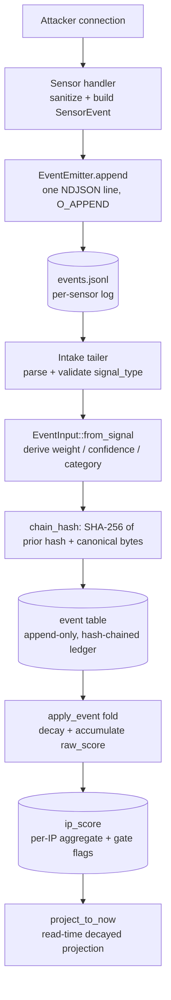
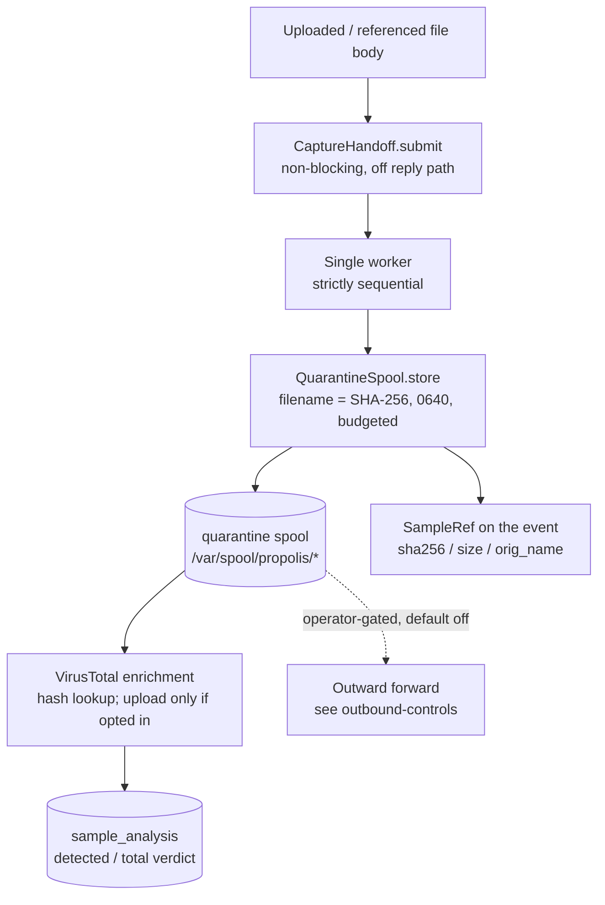

<!--
title: Event and sample lifecycle
audience: developer
status: current
owner: maintainer
applies-to: 0.3.0 (untagged; latest tag v0.1.0)
last-verified: 2026-08-26
-->

# Event and sample lifecycle

Two flows run from a single attacker connection: the **event** flow (what happened,
turned into a scored, tamper-evident ledger row) and the **sample** flow (any file
body the attacker uploaded or a dropper referenced, held in quarantine). They share
an origin at the sensor and then diverge — the event goes down the reply-blocking
path, the sample body goes off it.

## Event lifecycle

1. **Capture.** A sensor handler sanitizes every attacker string, builds a
   `SensorEvent` carrying raw facts only (no score), and calls
   `EventEmitter::append`, which writes exactly one NDJSON line to the sensor's log
   with `O_APPEND` (`crates/sensor-framework/src/emit.rs:40-53`). See
   [`sensors.md`](sensors.md).
2. **Wire record.** The line conforms to the frozen `SensorEvent` schema
   (`crates/sensor-wire/src/lib.rs:36-53`, `WIRE_VERSION = 1`). `signal_type` and
   `protocol` are plain strings on the wire so `sensor-wire` carries no scoring
   dependency; the record contains no `\n`/`\r` (NDJSON invariant). Field detail is
   owned by [`reference/events-and-signals.md`](../reference/events-and-signals.md).
3. **Intake.** The intake tailer consumes each NDJSON record and validates its
   `signal_type`/`protocol` against the known set. `EventInput::from_signal` derives
   `weight`, `confidence`, and `category` from the single-source-of-truth weight
   table (`crates/core-scoring/src/domain/weights.rs:11-37`) so a sensor never
   computes them. Weights and the derivation are owned by
   [`reference/events-and-signals.md`](../reference/events-and-signals.md).
4. **Hash-chained ledger.** Each row's hash is
   `SHA-256(prev_hash ‖ canonical_bytes(event))`
   (`crates/core-scoring/src/hashing.rs:131-136`). `canonical_bytes` writes a
   **frozen field order with length-prefixed framing** — it deliberately does not
   serialize the whole struct, and a golden vector pins the encoding. Any change to a
   hashed field, or any reorder/insertion, breaks the chain from that event forward.
   The hash is computed application-side; a DB `BEFORE INSERT` trigger
   (`enforce_chain_linkage`, migration `0005`) independently enforces that each new
   row's `prev_hash` matches the current chain head (fail-closed). Append-only is
   further enforced in the production database by a `REVOKE UPDATE, DELETE, TRUNCATE`
   on the `event` table (migration `0004`). Mechanism and the exact canonical
   encoding are owned by [`storage.md`](storage.md) and
   [`reference/database.md`](../reference/database.md).
5. **Scoring projection.** `apply_event` is a pure fold: it decays prior per-IP state
   to the event's `observed_at`, adds this event's weight, and recomputes all derived
   gate flags into the `ip_score` aggregate
   (`crates/core-scoring/src/scoring/engine.rs:56-173`). Reads use `project_to_now`,
   which decays to the wall clock without persisting (guarding against double-decay).
   How raw score becomes a tier, a recommendation, and a feed entry is the subject of
   [`pipeline.md`](pipeline.md); the constants are owned by
   [`reference/scoring-and-feed.md`](../reference/scoring-and-feed.md).

`session_id` correlates one sensor session's events (one SSH connection's logins,
execs, and transfers) and is **not** part of the hash chain, so adding it never
disturbs prior hashes (`crates/core-scoring/src/hashing.rs:105` — not hashed).

## Sample lifecycle

A "sample" is a captured file body: an attacker upload (SCP/SFTP, FTP `STOR`, ADB
`sync`) or a payload a dropper script referenced and the malware fetcher retrieved.
Only **SSH, FTP, and ADB** sensors spool bodies; the fetcher spools what it pulls.

1. **Off-path hand-off.** The handler builds a `CaptureJob` and `submit`s it; `submit`
   is backed by `mpsc::try_send` and never blocks the connection's reply — a full
   queue drops the job and increments a counter
   (`crates/sensor-framework/src/handoff.rs:109-148`). This keeps response latency
   from leaking whether a capture happened.
2. **Sequential worker + spool.** A single worker drains the queue and stores each
   body under its **SHA-256 filename** (never the attacker name), `0640`, with a
   per-file size cap (10 MB) and a global byte budget (100 MB) reserved atomically;
   the store is never called concurrently
   (`handoff.rs:159-233`, `spool.rs:114-196`). The emitted event carries a
   `SampleRef { sha256, size, orig_name }` where `orig_name` is a sanitized indicator
   only, never a path component. See
   [`security/malware-custody.md`](../security/malware-custody.md).
3. **Enrichment.** VirusTotal scanning walks the spool directories, filters to
   64-hex SHA-256 filenames, and looks up each new sample's hash, writing a verdict
   to `sample_analysis` (`crates/review/src/virustotal.rs:96-229`). A hash lookup
   sends only the hash. **Uploading an unknown sample body off-box is opt-in
   (`PROPOLIS_VT_UPLOAD`, default off).** The daily-budget cap and wiring are owned by
   [`reference/integrations.md`](../reference/integrations.md) and
   [`reference/rate-limits-and-budgets.md`](../reference/rate-limits-and-budgets.md).

> **Egress warning.** Enabling `PROPOLIS_VT_UPLOAD` forwards captured sample *bodies*
> to a third party. Captured samples are live malware and may contain attacker- or
> victim-identifying data. Treat any outward forward as an operator decision governed
> by [`security/outbound-controls.md`](../security/outbound-controls.md) and
> [`security/malware-custody.md`](../security/malware-custody.md).

The human gate on **reporting** — surfacing an IP for vendor abuse submission — is the
review queue, covered in [`pipeline.md`](pipeline.md). Sample bodies themselves are
never sent to abuse vendors; a vendor report carries only the source IP, categories,
and an evidence window (`crates/review/src/vendor/mod.rs:29-35`).

## Where each fact is owned

| Fact | Owner |
|---|---|
| Event fields, signal types, weights | [`reference/events-and-signals.md`](../reference/events-and-signals.md) |
| Tables, enums, migrations, hash-chain encoding | [`reference/database.md`](../reference/database.md), [`storage.md`](storage.md) |
| Spool paths, log paths | [`reference/filesystem-paths.md`](../reference/filesystem-paths.md) |
| Scoring constants, tiers, gates | [`reference/scoring-and-feed.md`](../reference/scoring-and-feed.md) |
| VirusTotal / vendor wiring | [`reference/integrations.md`](../reference/integrations.md) |
