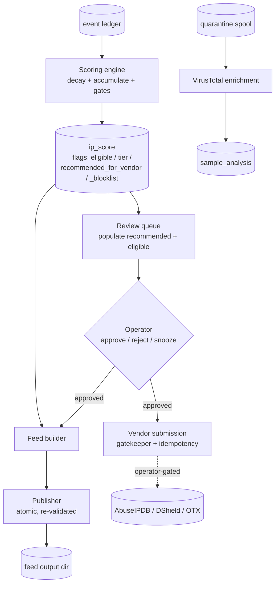

<!--
title: Scoring and feed pipeline
audience: developer
status: current
owner: maintainer
applies-to: 0.3.0 (untagged; latest tag v0.1.0)
last-verified: 2026-08-26
-->

# Scoring and feed pipeline

Once an event lands in the hash-chained ledger (see
[`event-and-sample-lifecycle.md`](event-and-sample-lifecycle.md)), it enters a
pipeline that turns accumulated evidence into a per-IP score, gates that score behind
operator review, enriches captured samples, and — only for entries that clear every
gate — publishes a blocklist feed and, optionally, reports the source IP to abuse
vendors.

All exact constants, thresholds, and tier floors are owned by
[`reference/scoring-and-feed.md`](../reference/scoring-and-feed.md); this page is the
narrative of how the stages connect. Every outward path in this pipeline is
operator-gated and defaults off or requires explicit approval — see
[`security/outbound-controls.md`](../security/outbound-controls.md).

## 1. Evidence becomes a score

The scoring engine (`crates/core-scoring/src/scoring/engine.rs`) folds each event
into a per-IP `ip_score` aggregate. `derive_projection` is the single source of truth
for gate derivation, shared by the write path (`apply_event`) and the read path
(`project_to_now`).

- **Decay + accumulate.** Prior state is decayed to the event's `observed_at`
  (`factor = 0.5 ^ (elapsed / half_life)`, half-life 6h), then this event's weight is
  added and clamped to a ceiling of 100. A repeat `(source_ip, signal_type)` inside a
  60-second window records the event but adds no weight. Clock-skew is clamped —
  decay only shrinks.
- **Confirmed-real latch.** `is_confirmed_real = protocol==Tcp && authenticated &&
  category==Honeypot`; the flag is sticky once set and never unsets
  (`engine.rs:145-146`). UDP/ICMP and unauthenticated traffic can never latch it —
  this is what stops a spoofed source from manufacturing merit.
- **Breadth multiplier.** `effective_score = min(100, raw * breadth_factor)`, where
  breadth rises 0.15 per extra distinct WAN vantage and saturates at 1.60. Only
  vantages that saw an authenticated TCP handshake are counted, and vantages dedup by
  /24 (IPv4) or /64 (IPv6) prefix (`breadth.rs`). This multi-WAN data feeds the
  internal score **only** and never leaves the system.
- **Persistence bonus.** A non-decaying count of distinct UTC active days adds a bonus
  to a **gate-facing** score (`gated_raw = min(100, raw + persistence_points)`),
  never to the stored raw — so a slow attacker the 6h decay would erase can still earn
  a tier over time without the bonus being double-counted on the next decay
  (`engine.rs:212-220`).
- **Tier.** `tier(gated_raw, max_confidence)` yields **Aggressive** (`>= 90` and
  confidence `>= 0.95`), **Standard** (`>= 75` and confidence `>= 0.70`), or none. It
  runs on the gated raw, not the breadth-multiplied effective score. `max_confidence`
  is live-decayed and fails closed to 0 when empty.
- **Eligibility and recommendations.** `eligible = !delisted && has_confirmed_real &&
  event_count >= 2` (the older two-category requirement was dropped). From there:
  `recommended_for_vendor = eligible && tier.is_some()`;
  `recommended_for_blocklist = eligible && effective_score >= 50`, **or** an
  independent volume path (`established_event_count >= 1000` within 24h). The volume
  path counts only completed-TCP events, so a spoofed UDP/ICMP flood cannot volume-list
  an innocent third party — and it does not set `recommended_for_vendor`, so a bare
  flood is blocklisted locally but never reported upstream.

Exact constant values live in
[`reference/scoring-and-feed.md`](../reference/scoring-and-feed.md).

## 2. The review gate

A tier-based recommendation is a *proposal*, not a decision. The review queue
(`crates/review/src/queue.rs`) is the human gate between scoring and any outward
reporting:

- **populate** inserts every `ip_score` row that is both `recommended_for_vendor` and
  `eligible` and not already queued, snapshotting the score and categories at surface
  time; new rows enter **Pending**.
- **withdraw** removes Pending rows whose IP no longer qualifies; Approved, Rejected,
  and Snoozed rows are never touched, so a decision persists and `populate` never
  re-surfaces a rejected IP.
- Operator decisions (`approve` / `reject` / `snooze`) set state, `decided_at`, and
  notes; a missing IP returns `NotFound` rather than silently no-op-ing.
- `list_approved` (FIFO by `decided_at`) is what the vendor submission runner drains.

The queue reads **stored** flags, so it can be at most one scan interval stale by
design.

## 3. Enrichment

Enrichment attaches external context to captured evidence. It is separate from
scoring and never gates a score.

- **VirusTotal.** Captured samples in the quarantine spool are hash-looked-up against
  VirusTotal; the verdict (`detected`/`total`) is stored in `sample_analysis`. A hash
  lookup sends only the hash; uploading an unknown body is opt-in
  (`PROPOLIS_VT_UPLOAD`, default off). VirusTotal is a scanner, not a reporting
  vendor.
- **Malware fetcher.** When the fake shell records a dropper referencing a payload
  URL (`honeypot_file_download`), the fetcher (`crates/review/src/fetcher/`) may
  retrieve that payload for capture, behind a fail-closed SSRF guard that rejects
  reserved/own-host/rebinding targets, pins the resolved IP, caps bytes mid-stream,
  and never follows a redirect into an unvetted host. Retrieved bodies land in the
  same quarantine spool.
- **GeoLite2 ASN.** Feed exclusion can suppress trusted-org infrastructure by ASN,
  read from an **offline** GeoLite2 database (local file reads, not network); the
  allowlist is empty by default and short-circuits before any lookup.

Enrichment wiring, keys, and budgets are owned by
[`reference/integrations.md`](../reference/integrations.md) and
[`reference/rate-limits-and-budgets.md`](../reference/rate-limits-and-budgets.md).

## 4. Feed generation

The feed builder (`crates/feed/src/builder.rs`) decides membership by **retention
windows**, not a live-decayed score — every field is read as stored (as of the IP's
last event), so a tier cannot slide between builds.

- **Tier files require approval.** Tier candidates are the join of
  `recommended_for_blocklist && eligible && tier IS NOT NULL` **with**
  `review_queue.state = 'approved'`. A merit-tiered entry reaches the Aggressive or
  Standard tier files only after an operator approves it.
- **Volume entries auto-publish, windows only.** Volume-listed entries
  (`recommended_for_blocklist && eligible = false`, `tier = None`) land in the
  retention windows but never in the tier files, and need no approval.
- **TTLs and windows.** Aggressive entries expire after 24h, Standard after 48h;
  retention windows default to `24h,7d,30d,60d,90d`, nested by construction. Validity
  is anchored on `last_seen`, and every exported timestamp is coarsened to the hour
  (anti-deanonymization). Defaults are owned by
  [`reference/scoring-and-feed.md`](../reference/scoring-and-feed.md).
- **Exclusions.** Reserved ranges, an operator CIDR allowlist, an explicit delist,
  and optional ASN suppression are applied at build. Reserved-range checking uses the
  one shared list that also guards the vendor path.
- **Atomic publish.** The publisher renders every format (`.txt`, `.json`, `.csv`,
  `.cidr`, `.ipset`, `.nft`, `.pf`, `.alias`, `.hosts`, `.rpz`) plus a manifest to a
  same-filesystem staging directory, `fsync`s each file, re-validates every entry
  against exclusions (the first violation rejects the whole build), and swaps into the
  output directory with a two-rename atomic move. Any error aborts before the output
  directory is touched, so the previous feed stays in place. A self-check re-reads the
  staged `.txt` and compares SHA-256.

The builder/publisher runs inside the `propolis` daemon on an interval
(`PROPOLIS_FEED_BUILD_INTERVAL_SECS`, default 900s) and writes to a local output
directory (default `/var/lib/propolis/feed/current`).

> **Not a shipped timer.** Distributing the built feed off-box — for example syncing
> the output directory to a public blocklist repository — is an **operator setup
> step** (`deploy/blocklist-sync.sh`, referenced only by comment), not a systemd
> timer or cron unit shipped in `deploy/`. Publishing your blocklist is a deliberate
> egress decision; review
> [`security/outbound-controls.md`](../security/outbound-controls.md) first.

## 5. Vendor submission

Reporting a source IP to an abuse vendor is the pipeline's other outward path, and it
is gated twice: the IP must be **operator-approved** in the review queue, and it must
clear the gatekeeper.

- **Vendors.** AbuseIPDB, DShield/SANS ISC, and OTX (AlienVault/LevelBlue). The API
  key lives only on the adapter and is never logged. A vendor enabled with an empty
  key is forced disabled (fail-closed). DShield's wire contract is flagged in-code as
  provisional. See [`reference/integrations.md`](../reference/integrations.md).
- **Gatekeeper (`crates/review/src/vendor/gatekeeper.rs`).** An ordered, fail-closed
  sequence that short-circuits on the first hold: Reserved → Disabled → Stale (last
  seen older than 48h) → Cooldown (a prior success for this IP+vendor inside the
  cooldown) → RateLimit (vendor-wide successes inside the window) → ScoreFloor →
  CategoryFilter. A DB error during a check holds, never admits.
- **Idempotency.** The submission runner inserts a `success=false` row keyed
  `"{ip}:{vendor}:{date}"` **before** the HTTP call, then updates it with the outcome
  — so a retry within the same UTC day never double-reports, and a new day permits
  re-reporting.
- **What is not sent.** A report carries only `{source_ip, categories, comment,
  evidence_window}`. No WAN vantage, raw score, confidence, or sample body ever leaves
  in a report (`crates/review/src/vendor/mod.rs:29-35`). Captured passwords are
  dropped at the sensor and are structurally absent from every report.

> **Egress warning.** Enabling any vendor sends attacker IP addresses and category
> codes to a third-party service. Vendor submission is operator-configured and
> defaults to disabled. Confirm your legal and ethical posture
> ([`overview/ethical-use.md`](../overview/ethical-use.md)) before enabling.

## Where each fact is owned

| Fact | Owner |
|---|---|
| Scoring constants, tiers, gates, TTLs | [`reference/scoring-and-feed.md`](../reference/scoring-and-feed.md) |
| Signal weights, event fields | [`reference/events-and-signals.md`](../reference/events-and-signals.md) |
| Tables and migrations | [`reference/database.md`](../reference/database.md) |
| VirusTotal / vendor / GeoLite2 wiring | [`reference/integrations.md`](../reference/integrations.md) |
| Rate limits and budgets | [`reference/rate-limits-and-budgets.md`](../reference/rate-limits-and-budgets.md) |
| The five gated egress paths | [`security/outbound-controls.md`](../security/outbound-controls.md) |
