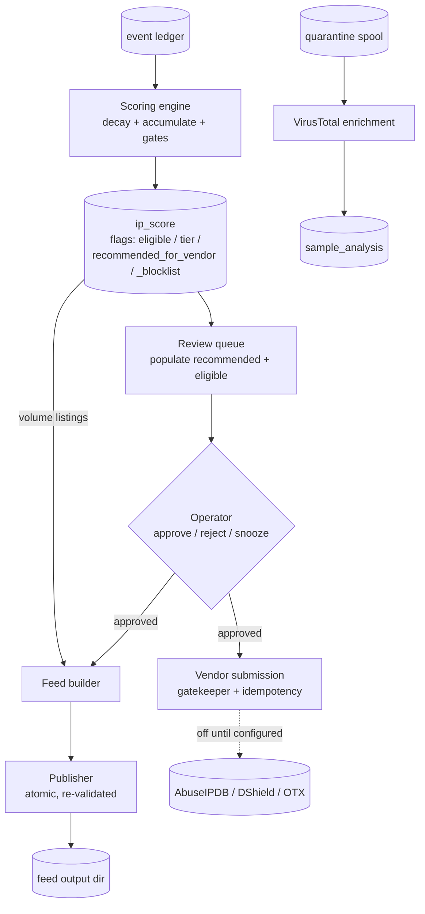

<!--
title: Scoring and feed pipeline
audience: developer
status: current
owner: maintainer
applies-to: 0.3.0 (untagged; latest tag v0.1.0)
last-verified: 2026-09-05
-->

# Scoring and feed pipeline

Once an event is in the ledger (see
[event and sample lifecycle](event-and-sample-lifecycle.md)), it feeds a per-IP score,
that score can put the IP in front of an operator, and the outcome is a blocklist feed
and, optionally, a report to an abuse vendor. This page explains how those stages
connect. The constants are in the [scoring and feed reference](../reference/scoring-and-feed.md).

Two outward paths exist and they are gated differently. Score-based tier entries and
vendor reports wait for an operator decision. Volume-based retention entries do not;
a flood is listed on connection count alone. The details are in sections 2 and 4.

## 1. Evidence becomes a score

The scoring engine in `crates/core-scoring` folds each event into the IP's `ip_score`
row. One function, `derive_projection`, computes every derived flag, and both the
write path and the read path call it, so a flag cannot mean one thing when stored and
another when displayed.

- **Decay and accumulate.** The stored score is decayed to the event's time with a
  six-hour half-life, the event's weight is added, and the result is capped at 100. A
  repeat of the same signal from the same IP within sixty seconds is recorded but adds
  no weight. Decay only ever shrinks a score; clock skew cannot inflate one.
- **Confirmed-real latch.** An event sets this flag when it arrived over TCP,
  authenticated against a honeypot sensor. It never unsets. UDP, ICMP and
  unauthenticated traffic cannot set it, which is what stops a spoofed source from
  earning merit on someone else's packets.
- **Breadth.** Activity seen from more than one of your WAN addresses raises the
  effective score, by 0.15 per extra address up to 1.6 times. Only addresses that saw
  an authenticated TCP handshake count, and addresses in the same /24 (or /64 for IPv6)
  count once. This multi-address view feeds the score only and never leaves the node.
- **Persistence.** The count of distinct active days does not decay and adds a bonus to
  the score used for gate decisions, so a slow attacker the decay would otherwise erase
  can still reach a tier. The bonus is never written back into the stored score.
- **Tier.** Aggressive needs a gate score of 90 and confidence of 0.95; Standard needs
  75 and 0.70. Confidence is the highest signal confidence seen, decayed.
- **Eligibility and recommendations.** An IP is eligible once it is confirmed-real,
  has at least two events, and has not been delisted. `recommended_for_vendor` is
  eligibility plus a tier. `recommended_for_blocklist` is eligibility plus an effective
  score of 50, or the volume rule: a thousand or more completed TCP connections on
  record and activity within the last day. Only completed-TCP events count toward
  volume, so a spoofed flood cannot volume-list a third party, and volume never sets
  `recommended_for_vendor`.

## 2. The review gate

A tier recommendation is a proposal. The review queue in `crates/review` is where an
operator turns it into a decision:

- Population inserts every IP that is both recommended for a vendor and eligible, with
  a snapshot of its score and categories at that moment, as **Pending**.
- Withdrawal removes Pending rows that no longer qualify. Approved, Rejected and
  Snoozed rows are never touched, so a rejected IP is not surfaced again.
- Approve, reject and snooze record the decision, the time and any notes. A decision
  on an unknown IP is an error, not a silent no-op.
- The vendor submitter drains approved rows oldest first.

The queue reads stored flags, so it can lag the scoring engine by one scan interval.

## 3. Enrichment

Enrichment adds context to captured evidence. It never changes a score.

- **VirusTotal.** Captured samples are looked up by hash; the verdict is stored in
  `sample_analysis`. A lookup sends only the hash. Uploading an unknown body is a
  separate opt-in.
- **Malware fetcher.** When a fake shell records a dropper referencing a URL, the
  fetcher in `crates/review/src/fetcher` may retrieve that payload. An SSRF guard
  rejects reserved, own-host and rebinding targets, pins the resolved IP, caps the body
  mid-stream, and refuses to follow a redirect to an unvetted host. What it retrieves
  lands in the same quarantine spool as uploaded samples.
- **GeoLite2.** Trusted-organisation ASNs can be kept off the feed using an offline
  GeoLite2 database. The list is empty by default and nothing is looked up until it is
  set.

Keys, budgets and wiring are in [integrations](../reference/integrations.md) and
[rate limits and budgets](../reference/rate-limits-and-budgets.md).

## 4. Feed generation

The feed builder in `crates/feed` decides membership from stored values as of each
IP's last event, so an entry cannot slide between tiers between builds.

- **Tier files.** An IP appears in the `aggressive` or `standard` file when it is
  recommended for the blocklist, eligible, has that tier, and is approved in the
  review queue. Aggressive entries expire 24 hours after last sighting, Standard after
  48.
- **Retention feeds.** The `all-24h`, `all-7d`, `all-30d`, `all-60d` and `all-90d`
  files hold every approved entry seen within the window, and also every volume-listed
  IP. Volume listings are the one automatic path into the feed: they need no approval,
  and they never reach the tier files.
- **Exclusions.** Reserved ranges, an operator CIDR allowlist, explicit delisting, and
  optional ASN suppression are applied at build time, using the same reserved-range
  list the vendor path uses.
- **Timestamps.** Every exported time is rounded to the hour so the feed does not reveal
  exactly when your sensors saw something.
- **Atomic publish.** Every format (`.txt`, `.json`, `.csv`, `.cidr`, `.ipset`, `.nft`,
  `.pf`, `.alias`, `.hosts`, `.rpz`) and a manifest are written to a staging directory
  on the same filesystem, fsynced, re-checked against the exclusions, and swapped into
  place with two renames. An error at any point leaves the previous feed untouched.

The builder runs inside the daemon every fifteen minutes by default and writes to a
local directory. Shipping the files anywhere, for example to a public repository, is a
cron job you set up; `deploy/blocklist-sync.sh` is the script for it, and
[outbound controls](../security/outbound-controls.md) covers what publishing exposes.

## 5. Vendor submission

Reporting an IP to an abuse vendor is gated twice: the IP must be approved in the
review queue, and the report must pass the gatekeeper.

- **Vendors.** AbuseIPDB, DShield and OTX. A vendor configured with an empty key is
  disabled rather than tried. DShield's wire contract is marked provisional in the code.
- **Gatekeeper.** An ordered sequence of checks that stops at the first hold: reserved
  address, vendor disabled, last seen more than 48 hours ago, a successful report to
  this vendor within the cooldown, the vendor-wide rate limit, the score floor, and the
  category filter. A database error during a check holds the report.
- **Idempotency.** The runner claims a row keyed by IP, vendor and UTC date before
  calling the vendor, and records the outcome afterwards. A retry the same day reuses
  the row. If the row exists with no recorded outcome, an earlier attempt died between
  the call and the record, so the report is not re-sent; it is counted as unresolved
  instead.
- **What a report contains.** The source IP, category codes, a comment and the evidence
  window. No WAN address, score, confidence or sample body is included, and passwords
  were dropped at the sensor.

Enabling a vendor sends attacker IP addresses to a third party. Read
[ethical use](../overview/ethical-use.md) before turning one on.
