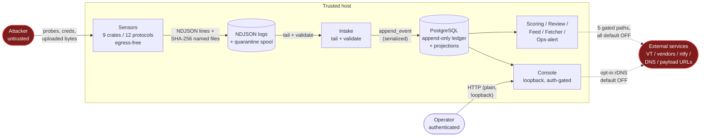

<!--
title: Trust boundaries and data flows
audience: security
status: current
owner: maintainer
applies-to: 0.3.0 (untagged; latest tag v0.1.0)
last-verified: 2026-08-26
-->

# Trust boundaries and data flows

This page maps the trust boundaries in a Propolis deployment, the inbound and outbound
data flows that cross them, and the egress posture - what makes outbound network
requests, and under what operator control.

The threat model and trust assumptions are owned by
[security/threat-model.md](../security/threat-model.md); the five gated egress paths
are owned by [security/outbound-controls.md](../security/outbound-controls.md). This
page is the architectural view that ties them to the data flows.

## Actors and trust zones

| Zone | Trust | What lives here |
|---|---|---|
| **Attacker** | Untrusted (hostile) | Any client reaching a sensor port; every byte is adversary-controlled. |
| **Sensors** | Low-trust, exposed | The 9 sensor crates (12 protocols). Attacker-facing; run unprivileged, egress-free by construction. |
| **Local channel** | Trusted host | Per-sensor NDJSON log files and the on-disk quarantine spool. One-directional, local storage. |
| **Datastore** | Trusted | PostgreSQL: the append-only hash-chained ledger and its projections. |
| **Platform** | Trusted | Intake, scoring, review, feed, malware fetcher, ops-alerting - the processing tier. |
| **Operator** | Authenticated | The console user, behind session auth on a loopback bind. |
| **External services** | Third-party | VirusTotal, abuse vendors, the operator's ntfy server, the public DNS resolver, attacker-hosted payload URLs. |

Solid arrows are always-on internal flows; dashed arrows are **operator-gated,
default-off** egress.

## Inbound data flow (attacker → ledger)

1. **Capture.** An attacker connects to a sensor port. The sensor's listener enforces
   per-connection bounds (a `Semaphore` concurrency cap that refuses excess
   connections immediately, and a max-duration timeout), isolates each connection's
   handler in `catch_unwind`, and never sends a UDP response. See
   [concurrency and failure](./concurrency-and-failure.md).
2. **Sanitize at the boundary.** Every attacker-controlled string routes through one
   shared chokepoint (`sanitize_value`) before it can enter an event: line-breaking
   whitespace collapsed first, then ANSI/control/bidi/zero-width/tag-block characters
   stripped, then NFC-normalized and length-capped on a UTF-8 boundary. Byte-derived
   fields are hex-encoded ("safe by alphabet"). This closes the forged-second-NDJSON-
   line class. See [input handling](../security/input-handling.md).
3. **Emit.** The sensor writes one NDJSON `sensor-wire` record per event to its local
   log via a single atomic `O_APPEND` `write_all` - an event exists once and only once
   it lands as a complete line. Captured file bodies go to the quarantine spool
   off the response path (see [malware custody](../security/malware-custody.md)); the
   record carries only a SHA-256 reference.
4. **Intake.** The intake binary tails each sensor log on its own task against a shared
   `PgPool`, validates the wire record's `signal_type`/`protocol` against the known
   set, derives weight/confidence/category (the sensor never computes them), and calls
   `append_event`. Appends are serialized by a Postgres advisory lock and the DB-layer
   chain trigger rejects any bad linkage fail-closed. See
   [storage](./storage.md).

Note the transport: **sensors never talk to intake directly.** The only channel is
the local NDJSON file on local storage - a one-directional trust boundary. A
compromised sensor can write lines to its own log, but it cannot reach the database,
another sensor, or the network.

## Outbound data flow (egress posture)

**The platform is not "egress-free"; only the sensor crates are.** Each
attacker-facing sensor has no HTTP client in its own dependency closure, enforced by
per-sensor tests that ban `reqwest/hyper/ureq/curl/isahc/surf/attohttpc`. The
workspace lockfile *does* contain `reqwest` and `hyper` - they belong to the platform
tier (review, the fetcher, VirusTotal, ops-alert), never to a sensor.

The daemon has **five outbound integrations, every one opt-in and defaulting OFF**,
several fail-closed if their credential or topic is missing. A split deployment adds
the collector's mTLS connection to your own gateway, and publishing the feed is a cron
job you install; both are inventoried alongside the five. The
canonical owner of their exact env flags and semantics is
[security/outbound-controls.md](../security/outbound-controls.md);
[reference/environment-variables.md](../reference/environment-variables.md) owns the
flag defaults. In summary:

| # | Path | Component | Gate (default off) | Direction |
|---|---|---|---|---|
| 1 | VirusTotal sample lookup/upload | `review` | `PROPOLIS_VT_ENABLED` (+ non-empty key); upload a separate flag | outbound to VirusTotal |
| 2 | Abuse-vendor submitters (AbuseIPDB / DShield / OTX) | `review` | `PROPOLIS_VENDOR_<NAME>_ENABLED`; fail-closed with no key | outbound to vendor APIs |
| 3 | Malware fetcher (attacker-supplied URL) | `review::fetcher` | `PROPOLIS_FETCH_ENABLED` | outbound to attacker host, SSRF-guarded |
| 4 | Forward-confirmed reverse DNS | `console` | `PROPOLIS_CONSOLE_RDNS_ENABLED` | one PTR query via system resolver |
| 5 | Ops-alert ntfy POST | `propolis` daemon | ops-alert `enabled`; URL+topic then REQUIRED | outbound to operator's ntfy server |

Two of these carry extra structural controls worth stating here:

- **Path 3 (the fetcher)** is the only path that dials an **attacker-controlled URL**.
  It runs through a load-bearing SSRF vetter on the initial URL *and every redirect
  hop*, fail-closed at each step: scheme allowlist (http/https/tftp), `user:pass@host`
  rejected, DNS-rebinding defense (a mixed public+internal resolve rejects the whole
  host), the vetted IP pinned (never re-resolved on connect), and a forbidden-target
  check that rejects own-host and reserved/CGNAT/mapped-loopback addresses after
  canonicalizing IPv6 forms. See
  [security/never-execute.md](../security/never-execute.md) and
  [outbound controls](../security/outbound-controls.md).
- **Path 4 (rDNS)** is explicitly forbidden from being used as a suppression signal
  (PTR is spoofable, display-only). External-lookup links in the console detail view
  are rendered for the **operator's own browser** to follow - the box never leaks a
  captured IP to a third-party lookup service itself.

The **console, sensors, intake, feed, and core-scoring make no outbound requests**
beyond the PostgreSQL connection (and the opt-in rDNS lookup). A forbidden-egress
guard rejects own-host and reserved targets on the paths that do reach out.

Accurate framing: *sensors are egress-free by construction; the platform's few
enrichment and reporting egress paths are operator-gated and default off.* Never
"the whole system makes no outbound requests."

## Operator boundary

The operator crosses into the trusted zone only through the console, which serves
**plain HTTP on a loopback bind by default** (no in-process TLS - any TLS is
operator-provided in front of it) behind Argon2id password auth, an HMAC-signed
in-memory session, and CSRF on mutating actions. Internal-only attribution such as
`wan_ip` (the honeypot's own ingress address) is visible only in the auth-gated
console; it is **never** in the public blocklist feed. See
[console architecture](./console.md) and
[security/sample-and-credential-privacy.md](../security/sample-and-credential-privacy.md).

## Related

- [security/threat-model.md](../security/threat-model.md) - threat model and trust
  assumptions.
- [security/outbound-controls.md](../security/outbound-controls.md) - the five gated
  egress paths (canonical).
- [security/attack-surfaces.md](../security/attack-surfaces.md) - the inbound attack
  surface.
- [architecture/storage.md](./storage.md) - the ledger the flows converge on.
