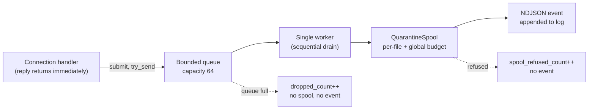

<!--
title: Queue and spool behavior
audience: operator
status: current
owner: maintainer
applies-to: 0.3.0 (untagged; latest tag v0.1.0)
last-verified: 2026-08-26
-->

# Queue and spool behavior

What happens between a captured malware body and a stored sample, and what an operator sees
when either stage is overloaded. This is the operational companion to [capacity
planning](./capacity-planning.md) (the numbers) and [event and sample
lifecycle](../architecture/event-and-sample-lifecycle.md) (the design). Only the
`sensor-ssh`, `sensor-ftp`, `sensor-adb`, and `sensor-telnet` sensors spool bodies; the rest
capture metadata only.

## The hand-off path

A sensor never writes a captured body on the connection's response path. Doing so would make
the reply latency reveal whether a capture happened, so capture is pushed onto a bounded queue
drained by a single background worker, off the response path
(`crates/sensor-framework/src/handoff.rs:1-14`).

Key properties:

- **Bounded queue, capacity 64.** `submit` is backed by `mpsc::try_send` and **never blocks**:
  if the queue is full the job is dropped immediately (`handoff.rs:104-141`).
- **Exactly one worker.** The worker drains the queue strictly sequentially, so
  `spool.store` is never called concurrently; a second `start_worker` call panics
  (`handoff.rs:159-188`).
- **Panic isolation.** A panicking event builder is caught (`catch_unwind`) and the worker
  continues (`handoff.rs:200-225`).

## What an operator sees under overload

Two counters and two WARN patterns distinguish the two ways a capture can be lost, both visible
in `journalctl`. (The ops-alert monitor watches spool disk free space rather than these
counters; see [health and observability](./health-and-observability.md).)

### Queue-full drops (`dropped_count`)

When an attacker floods uploads faster than the single worker drains, the queue fills and
`submit` drops jobs. Each drop increments `dropped_count` and logs a WARN **only at power-of-two
totals** (drop 1, 2, 4, 8, 16, ...), so the first drop is loud and a sustained flood degrades to
logarithmic noise instead of filling the log partition it shares
(`handoff.rs:125-148`). A dropped job produces no stored sample and no event. This is a
deliberate trade of completeness for covertness under load, not an error.

Log line (example): `capture hand-off: queue full, sample dropped (no spool, no event)` with
`dropped_total=<N>`.

### Spool refusals (`spool_refused_count`)

A body that reaches the worker but the spool rejects increments `spool_refused_count` and logs
a WARN **per refusal** (`handoff.rs:150-216`). The spool refuses in two cases
(`crates/sensor-framework/src/spool.rs:134-196`):

- **`FileSizeExceeded`** - the body is larger than the per-file cap (10 MB for the spooling
  sensors).
- **`BudgetExhausted`** - the global byte budget (100 MB per spooling sensor) is already
  reserved. Reservation is atomic (`compare_exchange`), so the budget is a hard ceiling.

Unlike a queue drop, a spool refusal is the only in-process record that a capture was lost at
that stage, which is why every refusal logs (not just powers of two).

## Spool storage properties

The quarantine spool is content-addressed and fail-closed by construction
(`spool.rs:1-9,205-306`):

- files are named by the SHA-256 of their content, never by an attacker-supplied filename, so
  path traversal is structurally impossible;
- files are written `create_new` with `0640` permissions;
- reads re-hash and refuse on mismatch (`HashMismatch` -> corrupt, refused);
- duplicate content dedups on the existing hash and consumes no extra budget;
- on restart, `new()` re-scans the directory to recover used bytes, so a restart does not reset
  the budget ceiling.

Sample files are trimmed at 30 days; see [retention](./retention.md). Spool paths and budgets
are owned by [filesystem paths](../reference/filesystem-paths.md) and
[capacity planning](./capacity-planning.md). For symptom-based help see
[troubleshooting: queue and spool](../troubleshooting/queue-and-spool.md).
